# Manual de Usuario: NEXUS 🦅
**NEXUS** es el Centro de Mando Integral (CCO) definitivo para supervisores de la red ferroviaria (FGC). Bautizada con este nombre para reflejar su capacidad de ser el nexo de unión entre todo el operativo de la red, esta aplicación está diseñada para pasar de una mera "consulta de datos" a una herramienta predictiva y de control total. Permite obtener visibilidad global, gestionar crisis, administrar al personal (maquinistas y turnos), resolver incidencias y coordinar el parque de trenes en tiempo real.

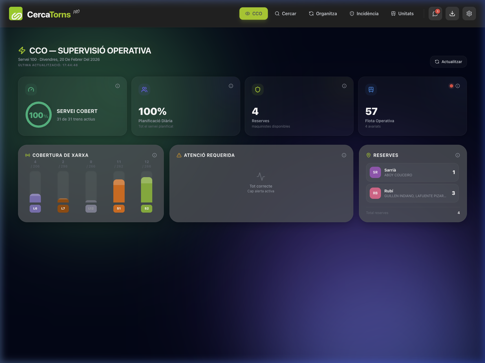
*Vista del Dashboard Principal 'Ojo de Halcón'.*

---

## 1. Primeros Pasos y Acceso

### 1.1 Pantalla de Carga y Acceso
Al abrir la aplicación, visualizarás una pantalla de carga o *SplashScreen* que sincroniza los últimos datos. Una vez que estés en el sistema, de forma obligatoria se solicitarán los datos básicos de perfil la primera vez:
- **Nombre y Apellido.**
- **Correo electrónico.**
- **Rol en FGC** (Supervisor, etc.).

### 1.2 Modal de Perfil y Preferencias
Puedes modificar tus datos en todo momento accediendo al icono de Ajustes (⚙️) o a tu avatar circular situado en el menú de la aplicación. 

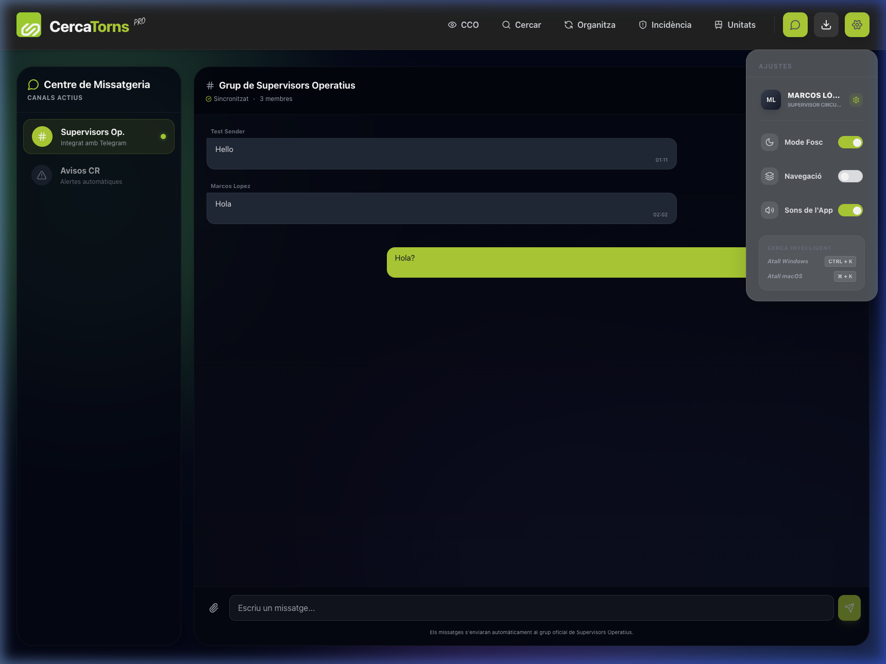
*Menú de configuración y preferencias.*

---

## 2. Interfaz y Navegación General

La aplicación está diseñada bajo el lema del "Ojo de Halcón" para encontrar rápido cualquier función. Existen modos de visualización adaptados a la comodidad del trabajo prolongado.

### 2.1 Menú Principal (Navbar y ProNav)
- **Top Navbar:** Por defecto (y siempre en móvil), el menú de iconos se sitúa en la parte superior. Permite acceder a todos los módulos.
- **ProNav (Sidebar Lateral):** Si la jornada exige más espacio, en la rueda de Ajustes (⚙️) encontrarás la opción "Navegación", la cual pasa el menú a una barra lateral exclusiva para versión de PC (Desktop), mejorando la productividad de la estación de trabajo.

### 2.2 Tema Visual y Sonidos
- **Modo Oscuro (Dark Mode):** Accesible desde el icono del sol/luna (☀️/🌙) o en los Ajustes (⚙️). Ideal para turnos de noche, cuidando la fatiga visual.
- **Sonidos Funcionales:** La aplicación emite sutiles "clicks" y campanadas de confirmación. En los Ajustes, puedes silenciar localmente estas notificaciones de feedback (Sons de l'App).

### 2.3 Búsqueda Inteligente (Paleta de Comandos)
Pulsando **`CTRL + K`** (Windows) o **`⌘ + K`** (macOS) en cualquier momento —o el gran botón flotante de la lupa en el móvil— se abre la **Cerca Intel·ligent**. Te permite saltar instantáneamente a turnos, maquinistas, o circulaciones.

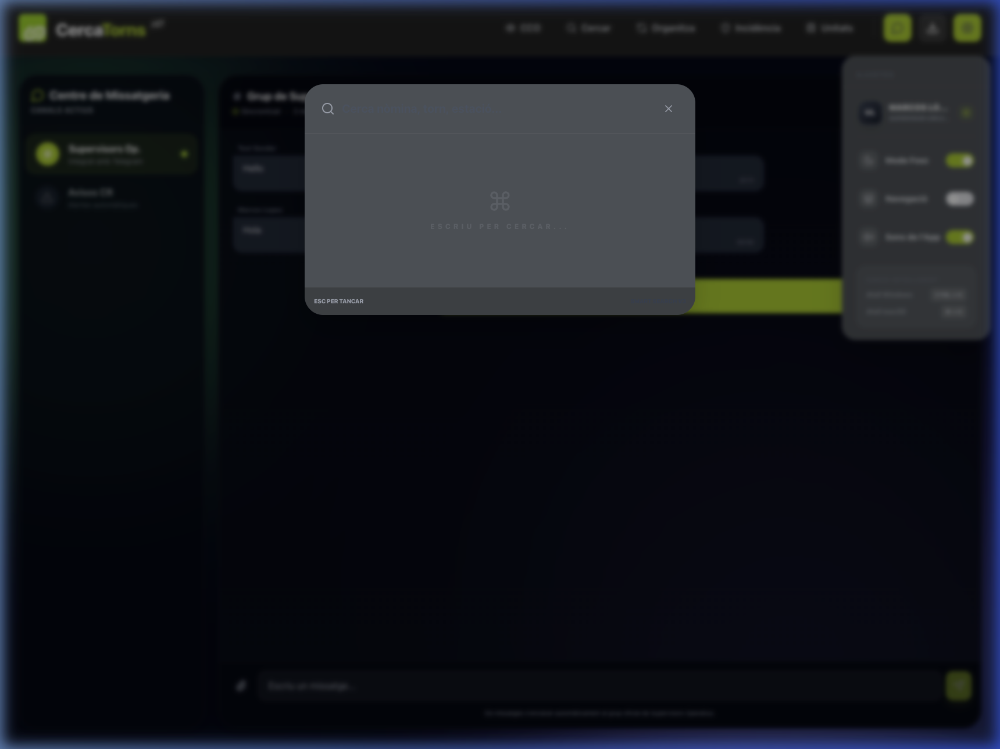
*Pantalla de Búsqueda Activa.*

### 2.4 Carga del "Plantejament" (Carga del PDF Diario)
El botón de descarga/carga (☁️⬇️) permite sincronizar manualmente mediante `FileUploadModal` el PDF oficial con todos los horarios de un nuevo día para que el sistema alimente sus bases de datos.

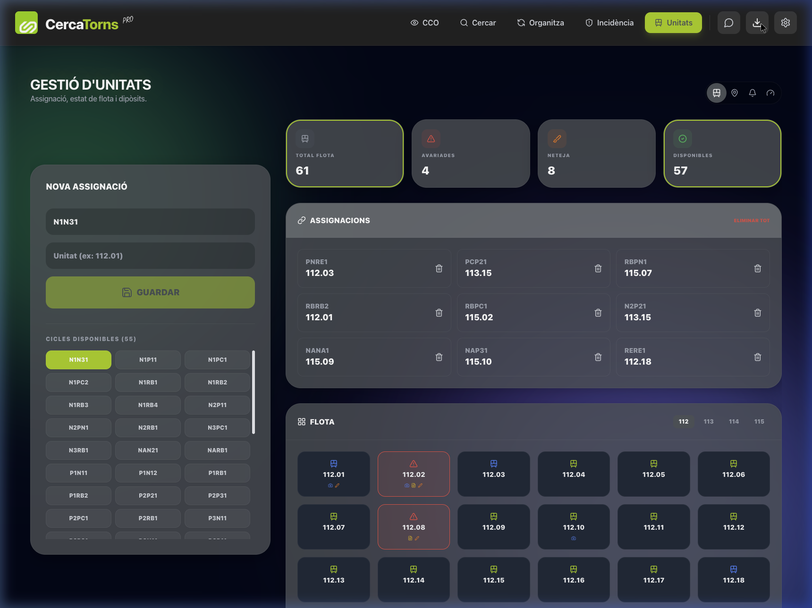
*Submenú y modal al cargar nuevo PDF.*

---

## 3. Módulos Principales de la Aplicación

La App se divide en 6 vistas centrales.

### 3.1 👁️ CCO (Dashboard Principal)
El tablero de control. Al iniciar, muestra una previsualización de KPIs vitales.
- **Estado de la Red:** Visualiza el alcance de cuellos de botella e incidencias activadas (`IncidènciaView`).
- **Atención Requerida:** Notifica si hay personal no presentado en tiempo, problemas mecánicos urgentes, formaciones averiadas y personal de reserva.

### 3.2 🔍 Cercar (Búsqueda)
El motor de búsqueda detallada donde entra el componente de inteligencia.
Desde aquí puedes cruzar información y ver el detalle en profundidad de:
- **Torns (Turnos):** A quién pertenece y qué franja cumple.
- **Circulacions:** Líneas que un tren está haciendo.

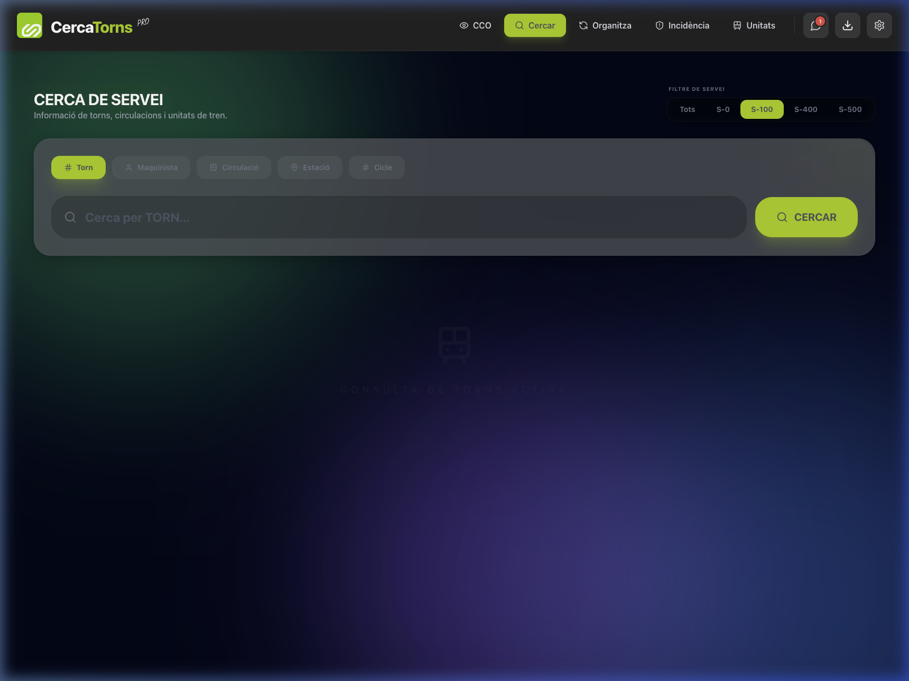
*Panel principal de Cercar Servei.*

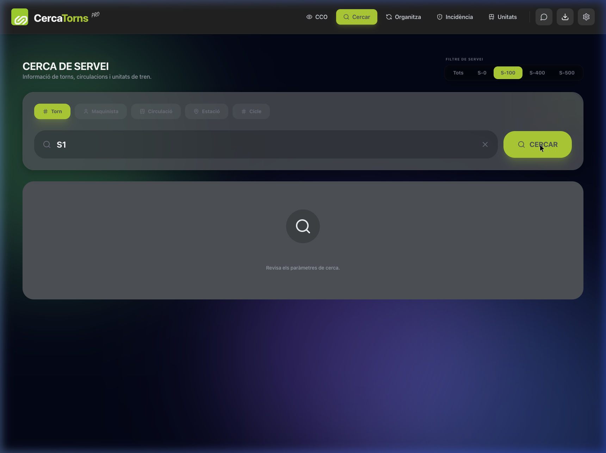
*Resultados al introducir un parámetro como "S1" en el buscador interactivo.*

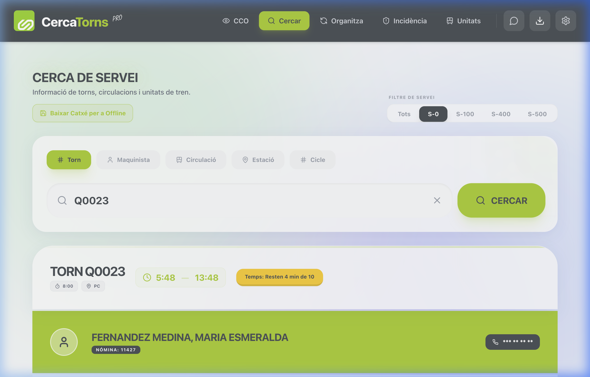
*Ejemplo de búsqueda del turno Q0023 en Modo Claro (Servei 0).*

### 3.3 🔄 Organitza (Gestión de Malla)
Para la gestión de los maquinistas, sus horarios, relevos y tiempos de descanso. Listados por cuadrantes e intercambios para gestionar ausencias imprevisibles.

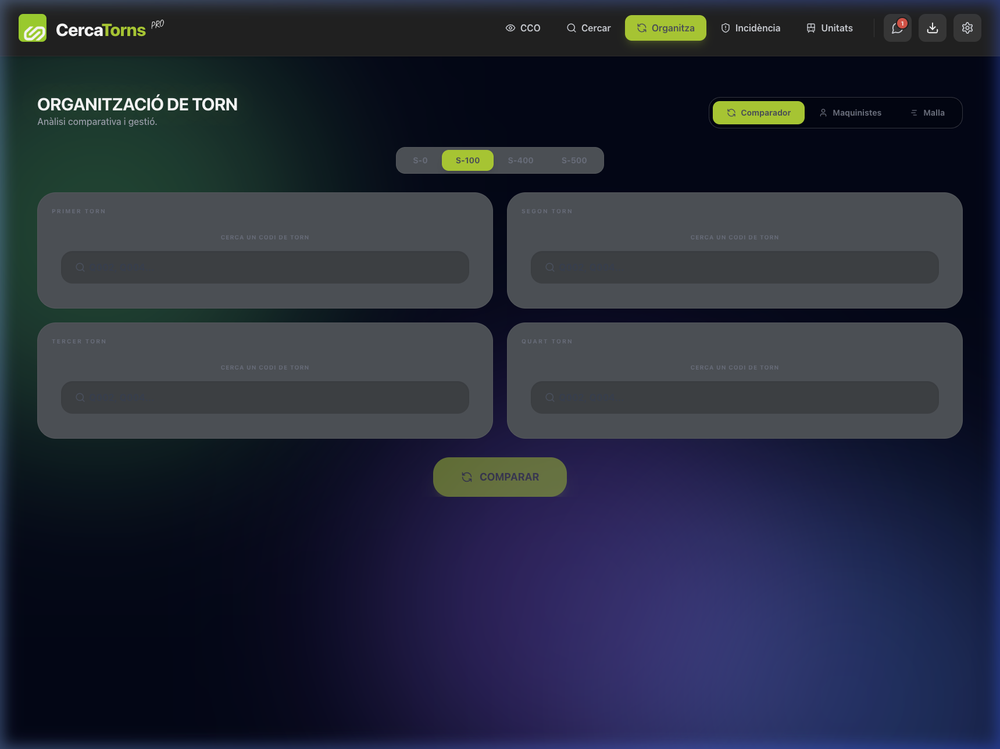
*Organización y Malla de Servicios.*

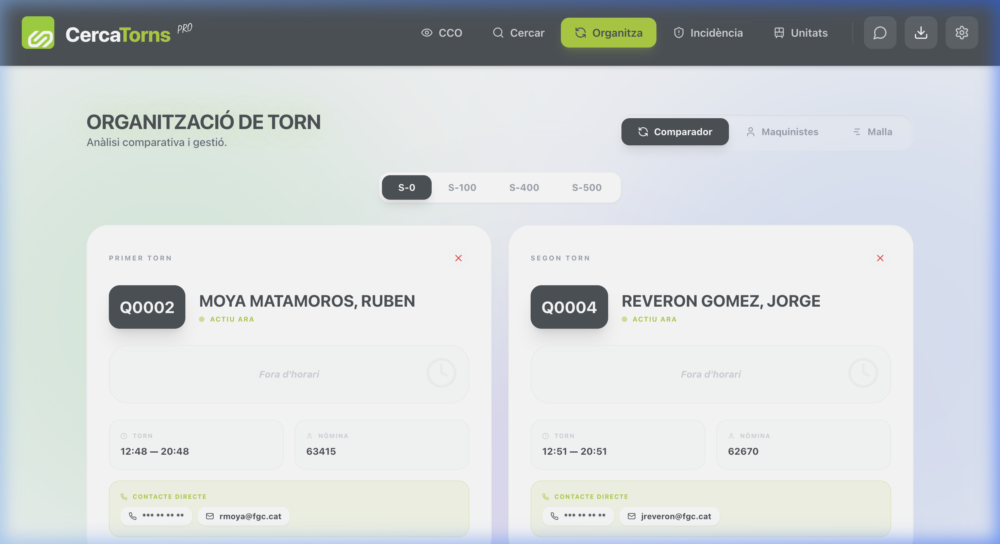
*Análisis comparativo entre los turnos Q0002 y Q0004 en Modo Claro (Servei 0).*

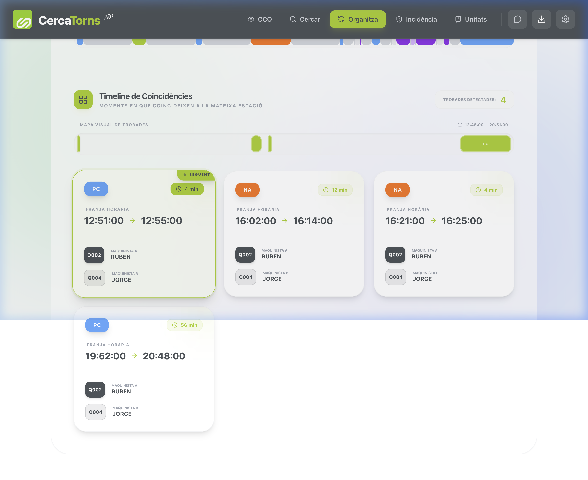
*Detalle del Timeline de Coincidencias y encuentros detectados entre ambos turnos.*

### 3.4 🛡️ Incidència (Gestión de Problemas y Crisis)
Todo lo que está provocando un problema entra aquí.
- Los supervisores marcan tramos de vía averiados, incidencias eléctricas, desvío de recorridos (Pla de Servei Alternatiu).

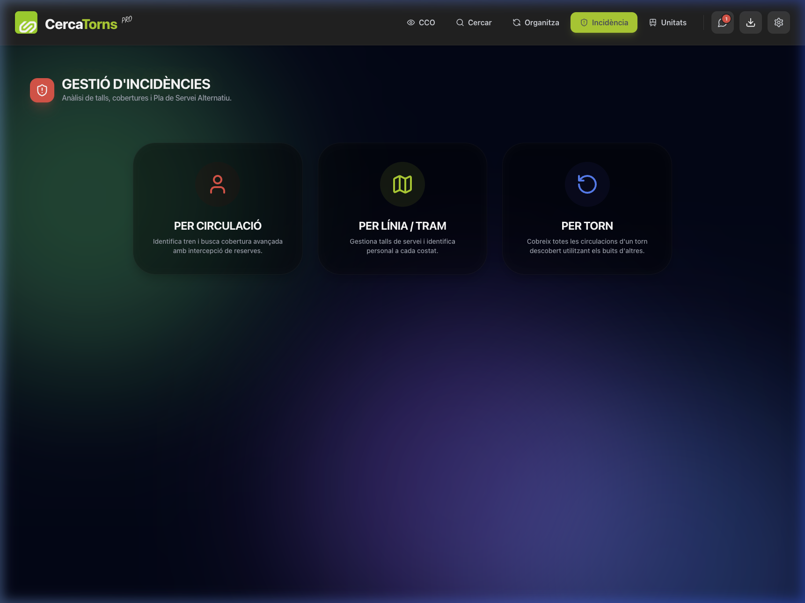
*Panel de Selección Rápida de Incidencias.*

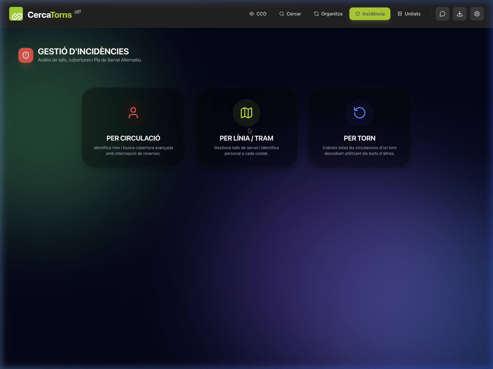
*Interfaz inmersiva tras hacer clic en "Per Línia / Tram" o "Circulació".*

### 3.5 🚆 Unitats (Cicles / Parque Móvil)
Unidades / Cicles controla los vehículos físicos de FGC.
- Visualización de unidades parqueadas (`Parked Units`) en cocheras o apartaderos.

*Gestión de parque móvil.*

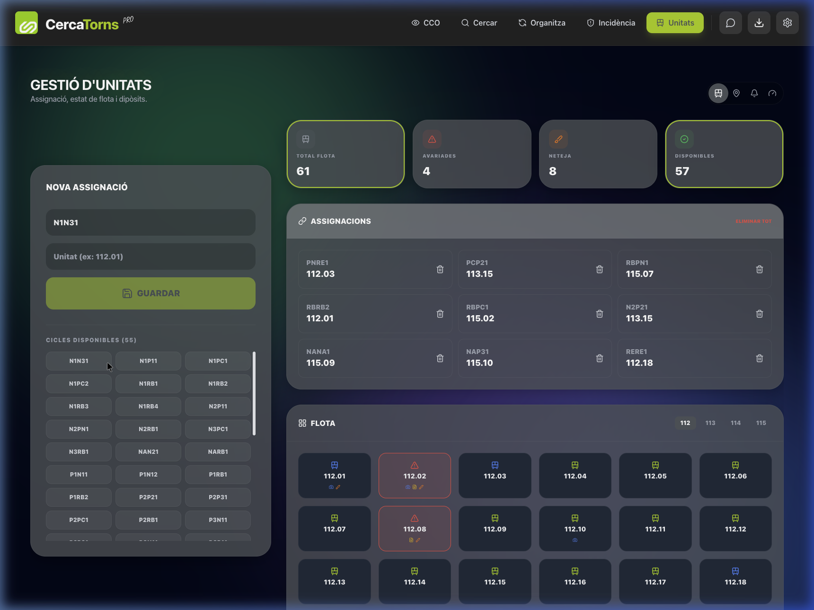
*Desplegables al hacer clic sobre una unidad o ciclo listado (ej. N1N31) para Asignaciones.*

### 3.6 💬 Missatges (Centro de Difusión y Telegram)
Herramientas de comunicación entre coordinadores y staff. Permite ver avisos directos y enviar notificaciones.

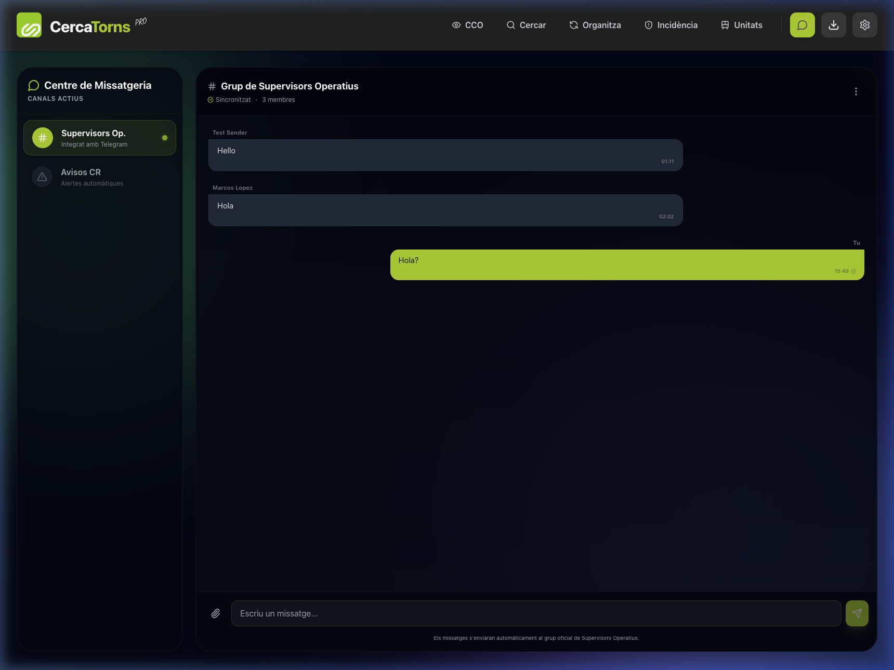
*Centro de Mensajería.*

---

## 4. Notas Técnicas Finales

- **Resiliencia (Modo Offline y Supabase):** Los sistemas centrales corren en Supabase y pueden utilizar cacheo local. Los mensajes son enviados y parseados en tiempo real. 
- **Accesibilidad y Respuestas Rápidas:** Las animaciones visuales fluidas garantizan una experiencia "Premium" para evitar que el software industrial sea pesado.
